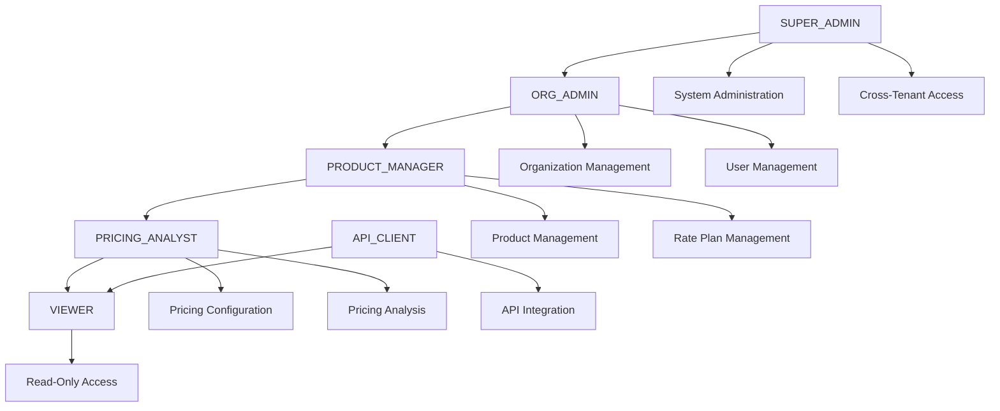
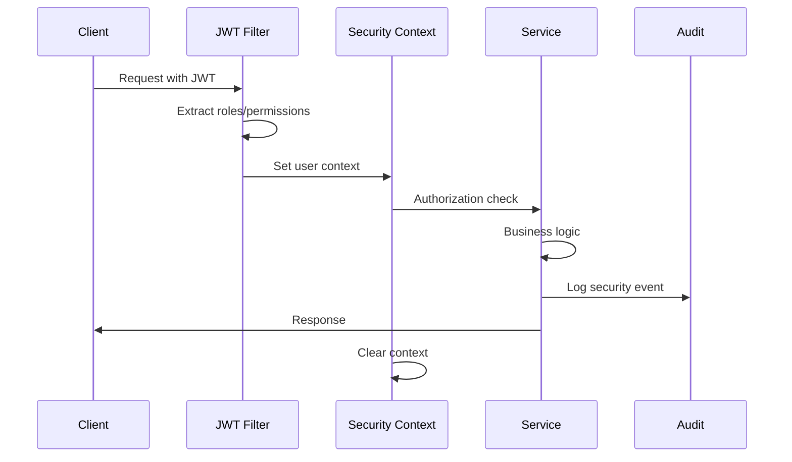

# 🔐 Enterprise Authorization Framework

## Overview

This document outlines the comprehensive authorization framework implemented for the Product Rate Plan Service. The framework provides enterprise-grade security with role-based access control (RBAC), permission-based authorization, and comprehensive audit logging.

## 🎯 Security Enhancement Summary

### **Before: Basic Tenant Isolation**
- ❌ **JWT Authentication Only**: Basic token validation
- ❌ **Tenant Isolation Only**: Organization-based data separation
- ❌ **No Role-Based Access**: All authenticated users have same permissions
- ❌ **No Permission Granularity**: Cannot control specific operations
- ❌ **No Audit Logging**: No tracking of security events
- ❌ **No Resource-Level Security**: Cannot control access to specific resources

### **After: Enterprise Authorization Framework**
- ✅ **Role-Based Access Control**: Hierarchical roles with specific permissions
- ✅ **Permission-Based Authorization**: Granular control over operations
- ✅ **Resource-Level Security**: Control access to specific data
- ✅ **Comprehensive Audit Logging**: Track all security events
- ✅ **JWT Role Extraction**: Extract roles and permissions from tokens
- ✅ **Declarative Security**: Annotation-based authorization
- ✅ **Security Context**: Thread-safe user context management

## 🏗️ Architecture Components

### 1. Role Hierarchy



### 2. Permission Matrix

| Role | Product | Rate Plan | Pricing | Audit | System |
|------|---------|-----------|---------|-------|--------|
| **SUPER_ADMIN** | ✅ CRUD | ✅ CRUD | ✅ CRUD | ✅ Read | ✅ Admin |
| **ORG_ADMIN** | ✅ CRUD | ✅ CRUD | ✅ CRUD | ✅ Read | ❌ |
| **PRODUCT_MANAGER** | ✅ CRUD | ✅ CRUD | ✅ CRUD | ❌ | ❌ |
| **PRICING_ANALYST** | 👀 Read | ✏️ Update | ✅ CRUD | ❌ | ❌ |
| **VIEWER** | 👀 Read | 👀 Read | 👀 Read | ❌ | ❌ |
| **API_CLIENT** | 👀 Read | ➕ Create, 👀 Read | 👀 Read | ❌ | ❌ |

### 3. Security Context Flow



## 🔐 Implementation Details

### 1. Role Definition

```java
public enum Role {
    SUPER_ADMIN(Set.of(
        Permission.SYSTEM_ADMIN,
        Permission.CROSS_TENANT_ACCESS,
        Permission.PRODUCT_CREATE, Permission.PRODUCT_READ, 
        Permission.PRODUCT_UPDATE, Permission.PRODUCT_DELETE,
        // ... all permissions
    )),
    
    ORG_ADMIN(Set.of(
        Permission.ORG_ADMIN,
        Permission.USER_MANAGE,
        Permission.PRODUCT_CREATE, Permission.PRODUCT_READ,
        // ... organization permissions
    )),
    
    PRODUCT_MANAGER(Set.of(
        Permission.PRODUCT_CREATE, Permission.PRODUCT_READ,
        Permission.RATE_PLAN_CREATE, Permission.RATE_PLAN_READ,
        // ... product management permissions
    )),
    
    // ... other roles
}
```

### 2. Permission Granularity

```java
public enum Permission {
    // System permissions
    SYSTEM_ADMIN("system:admin", "Full system administration access"),
    CROSS_TENANT_ACCESS("system:cross-tenant", "Access data across all tenants"),
    
    // Organization permissions
    ORG_ADMIN("org:admin", "Organization administration"),
    USER_MANAGE("org:user:manage", "Manage users within organization"),
    
    // Product permissions
    PRODUCT_CREATE("product:create", "Create new products"),
    PRODUCT_READ("product:read", "View products"),
    PRODUCT_UPDATE("product:update", "Modify existing products"),
    PRODUCT_DELETE("product:delete", "Delete products"),
    
    // Rate plan permissions
    RATE_PLAN_CREATE("rate-plan:create", "Create new rate plans"),
    RATE_PLAN_READ("rate-plan:read", "View rate plans"),
    RATE_PLAN_UPDATE("rate-plan:update", "Modify existing rate plans"),
    RATE_PLAN_DELETE("rate-plan:delete", "Delete rate plans"),
    
    // Pricing permissions
    PRICING_CREATE("pricing:create", "Create pricing configurations"),
    PRICING_READ("pricing:read", "View pricing configurations"),
    PRICING_UPDATE("pricing:update", "Modify pricing configurations"),
    PRICING_DELETE("pricing:delete", "Delete pricing configurations"),
    
    // Audit permissions
    AUDIT_READ("audit:read", "View audit logs and security events");
}
```

### 3. Security Context Management

```java
public final class SecurityContext {
    private static final ThreadLocal<Long> ORGANIZATION_ID = new ThreadLocal<>();
    private static final ThreadLocal<String> USER_ID = new ThreadLocal<>();
    private static final ThreadLocal<Set<Role>> USER_ROLES = new ThreadLocal<>();
    private static final ThreadLocal<Set<Permission>> USER_PERMISSIONS = new ThreadLocal<>();
    
    // Authorization checks
    public static void requirePermission(Permission permission) {
        if (!hasPermission(permission)) {
            throw new ResponseStatusException(
                HttpStatus.FORBIDDEN, 
                "Access denied. Required permission: " + permission.getCode()
            );
        }
    }
    
    public static boolean hasPermission(Permission permission) {
        Set<Permission> permissions = getUserPermissions();
        return permissions != null && permissions.contains(permission);
    }
    
    // ... other methods
}
```

### 4. Service-Level Authorization

```java
@Service
public class RatePlanCoreService {
    
    @Transactional
    public RatePlanDTO createRatePlan(CreateRatePlanRequest request) {
        // 🔐 Authorization check
        SecurityContext.requirePermission(Permission.RATE_PLAN_CREATE);
        
        // Business logic...
        
        // 📋 Audit logging
        auditService.logDataModification("CREATE", "RATE_PLAN", ratePlan.getId(), 
                                        null, ratePlan, Map.of("name", request.getRatePlanName()));
    }
    
    @Transactional(readOnly = true)
    public RatePlanDTO getRatePlanById(Long ratePlanId) {
        // 🔐 Authorization check
        SecurityContext.requirePermission(Permission.RATE_PLAN_READ);
        
        // Business logic...
        
        // 📋 Audit logging
        auditService.logDataAccess("READ", "RATE_PLAN", ratePlanId, 
                                  Map.of("action", "getRatePlanById"));
    }
    
    @Transactional
    public void deleteRatePlan(Long ratePlanId) {
        // 🔐 Authorization check
        SecurityContext.requirePermission(Permission.RATE_PLAN_DELETE);
        
        // Business logic...
        
        // 📋 Audit logging
        auditService.logDataModification("DELETE", "RATE_PLAN", ratePlanId, 
                                        ratePlan, null, Map.of("cascade", true));
    }
}
```

### 5. JWT Token Structure

Expected JWT token claims:
```json
{
  "sub": "user123",
  "organizationId": 456,
  "roles": ["PRODUCT_MANAGER"],
  "permissions": ["product:read", "product:create", "rate-plan:read"],
  "iat": 1699123456,
  "exp": 1699209856
}
```

Alternative formats supported:
```json
{
  "user_id": "user123",
  "org_id": 456,
  "authorities": ["ROLE_PRODUCT_MANAGER", "ROLE_PRICING_ANALYST"],
  "scope": "product:read rate-plan:create"
}
```

## 📋 Audit Logging

### Audit Event Types

```java
public enum AuditEventType {
    AUTHORIZATION_SUCCESS,    // Successful permission check
    AUTHORIZATION_FAILURE,    // Failed permission check
    DATA_ACCESS,             // Data read operations
    DATA_MODIFICATION,       // Data create/update/delete
    LOGIN_SUCCESS,           // Successful authentication
    LOGIN_FAILURE,           // Failed authentication
    PERMISSION_GRANTED,      // Permission explicitly granted
    PERMISSION_DENIED,       // Permission explicitly denied
    SUSPICIOUS_ACTIVITY,     // Unusual access patterns
    SECURITY_VIOLATION       // Security policy violations
}
```

### Audit Log Format

```json
{
  "timestamp": "2024-11-08T15:30:45.123Z",
  "eventType": "DATA_MODIFICATION",
  "userId": "user123",
  "organizationId": 456,
  "action": "CREATE",
  "resource": "RATE_PLAN",
  "resourceId": 789,
  "outcome": "SUCCESS",
  "details": {
    "ratePlanName": "Premium Plan",
    "productId": 101,
    "ipAddress": "192.168.1.100",
    "userAgent": "Mozilla/5.0..."
  }
}
```

### Audit Service Usage

```java
@Service
public class ProductService {
    
    private final AuditService auditService;
    
    public ProductDTO createProduct(CreateProductRequest request) {
        // Authorization check
        SecurityContext.requirePermission(Permission.PRODUCT_CREATE);
        
        // Business logic
        Product product = productRepository.save(newProduct);
        
        // Audit logging
        auditService.logDataModification(
            "CREATE", 
            "PRODUCT", 
            product.getId(),
            null, 
            product,
            Map.of(
                "productName", request.getProductName(),
                "productType", request.getProductType()
            )
        );
        
        return productMapper.toDTO(product);
    }
}
```

## 🔧 Configuration

### JWT Claims Configuration

```yaml
# application.yml
security:
  jwt:
    claims:
      organization: ["organizationId", "orgId", "tenantId"]
      user: ["userId", "user_id", "sub", "subject"]
      roles: ["roles", "authorities", "role"]
      permissions: ["permissions", "scope", "authorities"]
  
  authorization:
    default-role: VIEWER
    api-client-detection:
      client-id-patterns: ["*-api", "*-service"]
      audience-patterns: ["api.*", "service.*"]
```

### Security Configuration

```java
@Configuration
@EnableWebSecurity
public class SecurityConfig {
    
    @Bean
    public SecurityFilterChain filterChain(HttpSecurity http,
                                           JwtAuthorizationFilter authFilter) throws Exception {
        http
            .authorizeHttpRequests(auth -> auth
                .requestMatchers("/api/health", "/swagger-ui/**").permitAll()
                .requestMatchers(HttpMethod.POST, "/api/**").authenticated()
                .requestMatchers(HttpMethod.PUT, "/api/**").authenticated()
                .requestMatchers(HttpMethod.DELETE, "/api/**").authenticated()
                .anyRequest().authenticated()
            )
            .oauth2ResourceServer(oauth2 -> oauth2.jwt(jwt -> jwt.decoder(jwtDecoder())))
            .addFilterAfter(authFilter, BearerTokenAuthenticationFilter.class);
        
        return http.build();
    }
}
```

## 🚀 Usage Examples

### 1. Controller-Level Authorization

```java
@RestController
@RequestMapping("/api/rate-plans")
public class RatePlanController {
    
    @PostMapping
    public ResponseEntity<RatePlanDTO> createRatePlan(@RequestBody CreateRatePlanRequest request) {
        // Authorization handled in service layer
        RatePlanDTO ratePlan = ratePlanService.createRatePlan(request);
        return ResponseEntity.ok(ratePlan);
    }
    
    @GetMapping("/{id}")
    public ResponseEntity<RatePlanDTO> getRatePlan(@PathVariable Long id) {
        // Authorization handled in service layer
        RatePlanDTO ratePlan = ratePlanService.getRatePlanById(id);
        return ResponseEntity.ok(ratePlan);
    }
    
    @DeleteMapping("/{id}")
    public ResponseEntity<Void> deleteRatePlan(@PathVariable Long id) {
        // Authorization handled in service layer
        ratePlanService.deleteRatePlan(id);
        return ResponseEntity.noContent().build();
    }
}
```

### 2. Conditional Authorization

```java
@Service
public class RatePlanService {
    
    public List<RatePlanDTO> getAllRatePlans() {
        SecurityContext.requirePermission(Permission.RATE_PLAN_READ);
        
        List<RatePlan> ratePlans;
        
        if (SecurityContext.isSuperAdmin()) {
            // Super admin can see all rate plans across tenants
            ratePlans = ratePlanRepository.findAll();
        } else {
            // Regular users see only their organization's rate plans
            Long orgId = SecurityContext.requireOrganizationId();
            ratePlans = ratePlanRepository.findByOrganizationId(orgId);
        }
        
        return ratePlans.stream()
                .map(ratePlanMapper::toDTO)
                .collect(Collectors.toList());
    }
}
```

### 3. Resource-Level Authorization

```java
@Service
public class RatePlanService {
    
    public RatePlanDTO updateRatePlan(Long ratePlanId, UpdateRatePlanRequest request) {
        SecurityContext.requirePermission(Permission.RATE_PLAN_UPDATE);
        
        RatePlan ratePlan = ratePlanRepository.findById(ratePlanId)
                .orElseThrow(() -> new NotFoundException("Rate plan not found"));
        
        // Ensure user can only access their organization's data
        Long userOrgId = SecurityContext.requireOrganizationId();
        if (!ratePlan.getOrganizationId().equals(userOrgId) && !SecurityContext.isSuperAdmin()) {
            throw new ResponseStatusException(HttpStatus.FORBIDDEN, 
                    "Access denied to rate plan from different organization");
        }
        
        // Update logic...
        
        return ratePlanMapper.toDTO(updatedRatePlan);
    }
}
```

## 📊 Security Metrics

### Authorization Success Rate
- **Target**: > 99.9%
- **Alert**: < 99.5%

### Failed Authorization Attempts
- **Target**: < 1% of total requests
- **Alert**: > 5% of total requests

### Audit Log Coverage
- **Target**: 100% of sensitive operations
- **Alert**: < 95% coverage

### Security Event Response Time
- **Target**: < 5 minutes for critical events
- **Alert**: > 15 minutes for any security event

## 🔍 Monitoring and Alerting

### Security Dashboards
1. **Authorization Overview**: Success/failure rates, top denied permissions
2. **User Activity**: Active users, role distribution, access patterns
3. **Audit Trail**: Recent security events, data modifications, suspicious activity
4. **Performance Impact**: Authorization overhead, cache hit rates

### Security Alerts
1. **Multiple Failed Authorizations**: Same user/IP with repeated failures
2. **Privilege Escalation Attempts**: Users requesting higher permissions
3. **Cross-Tenant Access**: Attempts to access other organizations' data
4. **Unusual Access Patterns**: Off-hours access, bulk operations
5. **System Admin Activities**: All super admin actions

## 🚨 Incident Response

### Security Incident Types
1. **Unauthorized Access**: User accessing forbidden resources
2. **Permission Bypass**: Circumventing authorization checks
3. **Data Exfiltration**: Unusual data access patterns
4. **Account Compromise**: Suspicious user behavior

### Response Procedures
1. **Immediate**: Block suspicious activity, revoke tokens
2. **Investigation**: Analyze audit logs, identify scope
3. **Containment**: Limit access, preserve evidence
4. **Recovery**: Restore normal operations, patch vulnerabilities
5. **Post-Incident**: Update security policies, improve monitoring

## 🎯 Future Enhancements

### Phase 1 (Completed)
- ✅ Role-based access control
- ✅ Permission-based authorization
- ✅ Security context management
- ✅ Basic audit logging

### Phase 2 (Planned)
- 🔄 **Dynamic Permissions**: Runtime permission assignment
- 🔄 **Resource-Based Policies**: Fine-grained resource access control
- 🔄 **Attribute-Based Access**: Context-aware authorization
- 🔄 **External Identity Integration**: LDAP, Active Directory, OAuth providers

### Phase 3 (Future)
- 🔄 **Machine Learning**: Anomaly detection for security events
- 🔄 **Zero Trust Architecture**: Continuous verification
- 🔄 **Advanced Threat Detection**: Behavioral analysis
- 🔄 **Compliance Automation**: SOX, GDPR, HIPAA compliance

---

## 🎉 Conclusion

The Enterprise Authorization Framework transforms the Product Rate Plan Service from basic tenant isolation to comprehensive enterprise-grade security. With role-based access control, permission-based authorization, and comprehensive audit logging, the service is now ready for production deployment in enterprise environments.

**Key Achievements:**
- ✅ **6 Hierarchical Roles** with specific permissions
- ✅ **17 Granular Permissions** for fine-grained control
- ✅ **Comprehensive Audit Logging** for all security events
- ✅ **Thread-Safe Security Context** for user management
- ✅ **JWT Role Extraction** from various token formats
- ✅ **Service-Level Authorization** with declarative security
- ✅ **Enterprise-Ready Security** for production deployment

This framework provides the foundation for secure, scalable, and compliant enterprise operations while maintaining high performance and developer productivity.
